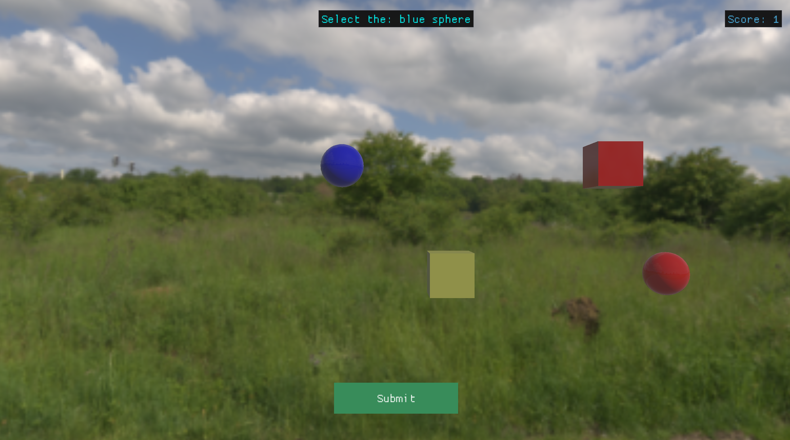

# Mimic Engine (C++)

Mimic is a C++ rudamentary game engine which aims to explore the inner  
workings of modern day game engines (e.g. Unity, Unreal and Godot). Mimic implements numerous 
techniques such as the CMake build system, entity-component Systems (ECS), resource management, simple, 
physics, OpenGL graphics, and libraries (e.g. ImGUI) to create a practical game, demonstrating the 
engine's core functionality.

Made using a variety of libraries and systems: CMake, ImGUI, GLEW, OpenGL, SDL2, assimp.  
Submitted as an assignment in my final year at Bournemouth University (2024).  

# More Details
You can learn more about Mimic Engine by reading my university assignment report - [here.](https://docs.google.com/document/d/1TTYsOLvguvOFiUQBfyq6qnSGWs7o1mrPLsaY9iNKPYM/edit?usp=sharing)

# Resources
Cmake: https://cmake.org/
OpenGL: https://www.opengl.org/
OpenAL: https://www.openal.org/
Dear ImGUI: https://github.com/ocornut/imgui
GLEW: https://glew.sourceforge.net/
SDL: https://www.libsdl.org/
assimp: https://assimp.org/
